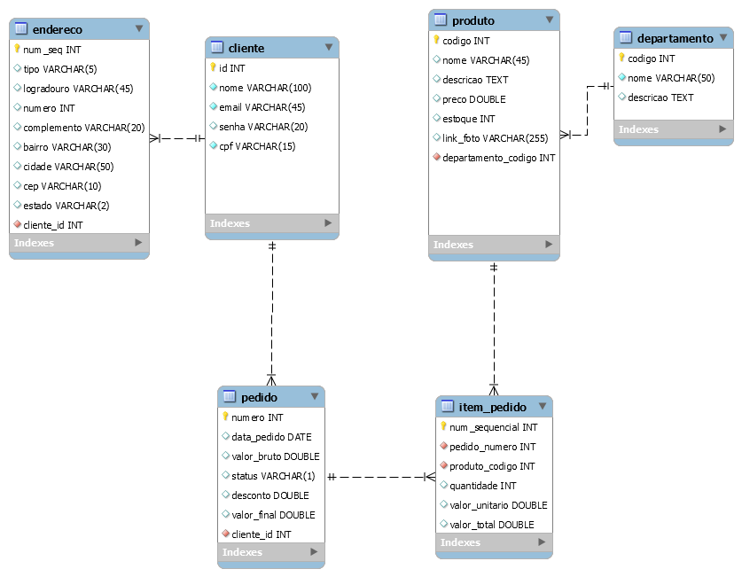

# CHALLENGE DATABASE FROM GAMA ACADEMY #XP40

# Diagrama do Banco de dados
   <h1 align = "center"> </h1>
   
Figura:

   

## Para executar os comandos, segue abaixo o conjunto de instruções SQL

    CREATE DATABASE 'nome do banco'; 

   e execute os comandos para criar as tabelas dos respectivos campos, clientes, departamentos, produtos.

   ⚠️ os comandos está no arquivo comandos.sql!

## Integrantes do Grupo

| [ Bruna Duarte](https://github.com/BrunaDuarte-3321) |  [ Raphael Muniz](https://github.com/raphaelsmuniz) |  [ David Bechi](https://github.com/davidbechi) |
| :---: | :---: | :---: |
